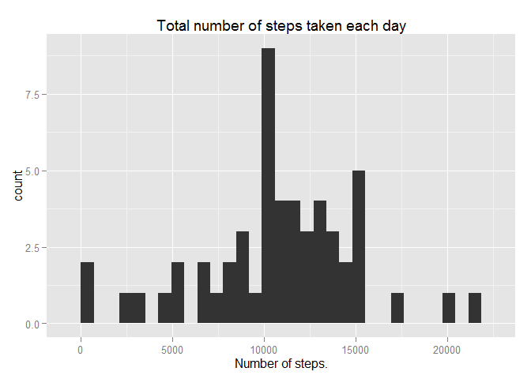

# Reproducible Research: Peer Assessment 1


## Loading and preprocessing the data

```r
data<-read.csv("activity.csv",sep=",",header=T)
head(data)
summary(data)
str(data)
```


## What is mean total number of steps taken per day?

```r
library("dplyr")
```

```
## 
## Attaching package: 'dplyr'
## 
## The following object is masked from 'package:stats':
## 
##     filter
## 
## The following objects are masked from 'package:base':
## 
##     intersect, setdiff, setequal, union
```

```r
library("ggplot2")
```

####Total number of steps taken per day

```r
by.day<-group_by(data, date)
steps.day<-summarise(by.day, total=sum(steps,na.rm=T))
steps.day
```

```
## Source: local data frame [61 x 2]
## 
##          date total
## 1  2012-10-01     0
## 2  2012-10-02   126
## 3  2012-10-03 11352
## 4  2012-10-04 12116
## 5  2012-10-05 13294
## 6  2012-10-06 15420
## 7  2012-10-07 11015
## 8  2012-10-08     0
## 9  2012-10-09 12811
## 10 2012-10-10  9900
## ..        ...   ...
```

####Calculate the median and mean of the total number of steps taken per day.

```r
summary(steps.day)
```

```
##          date        total      
##  2012-10-01: 1   Min.   :    0  
##  2012-10-02: 1   1st Qu.: 6778  
##  2012-10-03: 1   Median :10395  
##  2012-10-04: 1   Mean   : 9354  
##  2012-10-05: 1   3rd Qu.:12811  
##  2012-10-06: 1   Max.   :21194  
##  (Other)   :55
```
Mean is 9.354 steps.  
Median is 10.395 steps

####Histogram of the total number of steps taken each day

```r
qplot(total, data=steps.day, main="Total number of steps taken each day",
    xlab="Number of steps")
```

 


## What is the average daily activity pattern?

####A time series plot (i.e. type = "l") of the 5-minute interval (x-axis) and the average number of steps taken, averaged across all days (y-axis)

```r
by.interval<-group_by(data, interval)
steps.series<-summarise(by.interval, meanstep=mean(steps, na.rm=T))
qplot(interval,meanstep,data=steps.series,geom="line",main="Average daily 
      activity pattern", xlab="5 minutes interval",ylab="Average number of steps
      (all days)")
```

 

####5-minute interval, on average across all the days in the dataset, that contains the maximum number of steps.

```r
filter(steps.series, meanstep==max(meanstep))
```

```
## Source: local data frame [1 x 2]
## 
##   interval meanstep
## 1      835 206.1698
```


## Imputing missing values

####Total number of missing values in the dataset

```r
summary(data)
```

```
##      steps                date          interval     
##  Min.   :  0.00   2012-10-01:  288   Min.   :   0.0  
##  1st Qu.:  0.00   2012-10-02:  288   1st Qu.: 588.8  
##  Median :  0.00   2012-10-03:  288   Median :1177.5  
##  Mean   : 37.38   2012-10-04:  288   Mean   :1177.5  
##  3rd Qu.: 12.00   2012-10-05:  288   3rd Qu.:1766.2  
##  Max.   :806.00   2012-10-06:  288   Max.   :2355.0  
##  NA's   :2304     (Other)   :15840
```

```r
sum(is.na(data$steps))
```

```
## [1] 2304
```

####Strategy for filling in all of the missing values in the dataset
Use the mean for that 5-minute interval.

####New dataset that is equal to the original dataset but with the missing 
data filled in.

```r
datnew<-data
datnew$mean<-steps.series$meanstep
lost<-is.na(datnew$steps)
datnew[lost,"steps"]<-datnew[lost,"mean"]
head(datnew)
```

```
##       steps       date interval      mean
## 1 1.7169811 2012-10-01        0 1.7169811
## 2 0.3396226 2012-10-01        5 0.3396226
## 3 0.1320755 2012-10-01       10 0.1320755
## 4 0.1509434 2012-10-01       15 0.1509434
## 5 0.0754717 2012-10-01       20 0.0754717
## 6 2.0943396 2012-10-01       25 2.0943396
```

####Histogram of the total number of steps taken each day.

```r
by.day2<-group_by(datnew,date)
step.day2<-summarise(by.day2, sum=sum(steps))
qplot(sum, data=step.day2,main="Total number of steps taken each day (II)",
      xlab="Number of steps")
```

 

####Mean and median total number of steps taken per day.

```r
summary(step.day2)
```

```
##          date         sum       
##  2012-10-01: 1   Min.   :   41  
##  2012-10-02: 1   1st Qu.: 9819  
##  2012-10-03: 1   Median :10766  
##  2012-10-04: 1   Mean   :10766  
##  2012-10-05: 1   3rd Qu.:12811  
##  2012-10-06: 1   Max.   :21194  
##  (Other)   :55
```

####Impact of imputing missing data
Decreases the number of days with few steps.  
Increases the median and mean.  
Significantly increase days with about 11.000 steps (around median and mean)


## Are there differences in activity patterns between weekdays and weekends?

####Create a new factor variable in the dataset with two levels – “weekday” and 
“weekend”

```r
datnew$dayweek<-weekdays(as.Date(datnew$date))
datnew$dayweek[datnew$dayweek=="sábado"|datnew$dayweek=="domingo"]<-"weekend"
datnew$dayweek[!(datnew$dayweek=="weekend")]<-"weekday"
unique(datnew$dayweek)
```

```
## [1] "weekday" "weekend"
```

####Panel plot containing a time series plot (i.e. type = "l") of the 5-minute interval (x-axis) and the average number of steps taken, averaged across all weekday days or weekend days (y-axis).

```r
by.interval1<-group_by(datnew, dayweek, interval)
step.series1<-summarise(by.interval1, meanstep1=mean(steps))
qplot(interval,meanstep1, data=step.series1,facets=dayweek~. ,geom="line", 
      main="Activity patterns: weekdays and weekends", xlab="5 minutes interval",
      ylab="Average number of steps")
```

 
